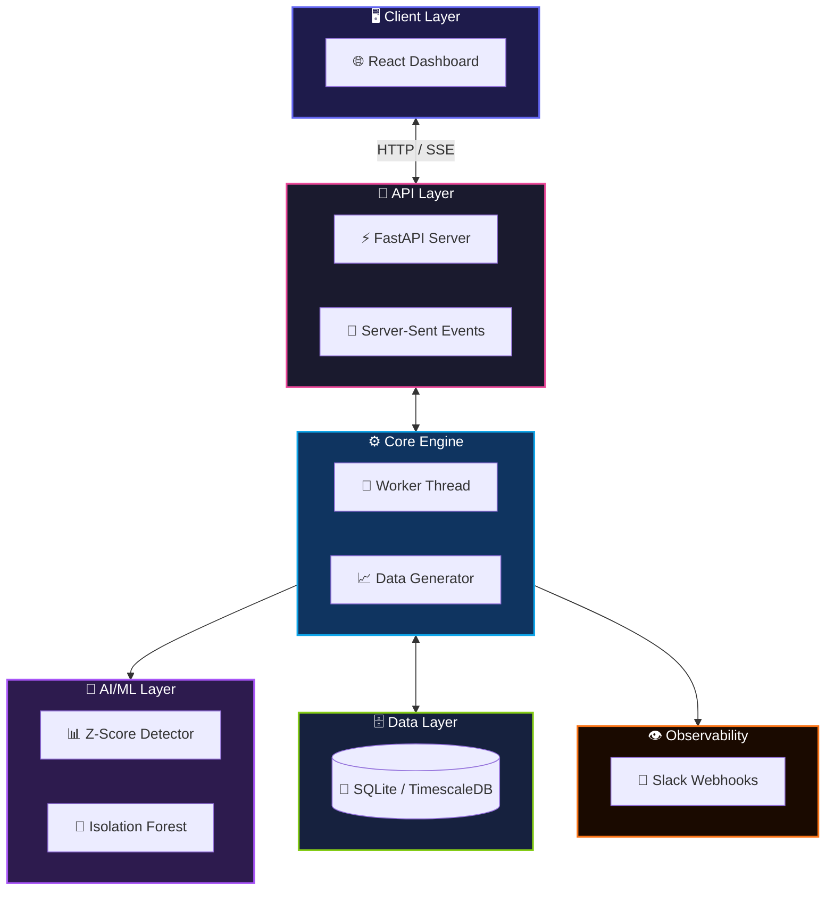
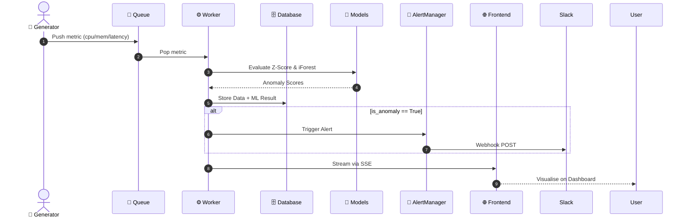
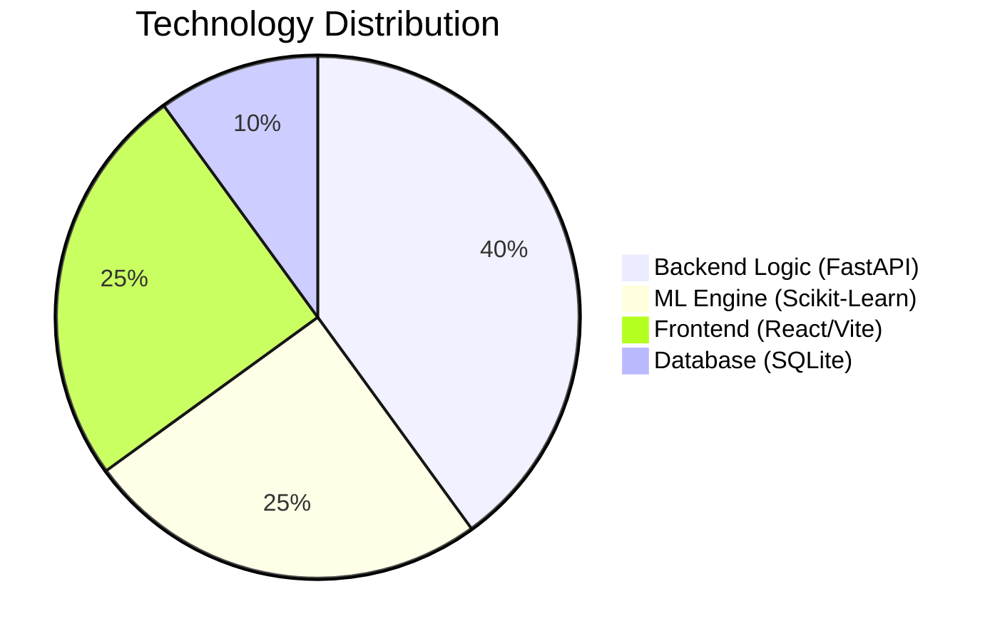

<div align="center">

<!-- Waving animated gradient banner -->


<!-- Typing SVG -->


<div align="center">


</div>

<br />

[🌐 Live Demo](#) &nbsp;&nbsp; [📖 Documentation](#) &nbsp;&nbsp; [🐛 Report Bug](https://github.com/AyushGU12/chronoshield/issues) &nbsp;&nbsp; [✨ Request Feature](https://github.com/AyushGU12/chronoshield/issues) &nbsp;&nbsp; [💬 Discussions](https://github.com/AyushGU12/chronoshield/discussions)

<svg width="700" height="120" xmlns="http://www.w3.org/2000/svg">
  <defs>
    <filter id="neon-glow">
      <feGaussianBlur stdDeviation="4" result="coloredBlur"/>
      <feMerge>
        <feMergeNode in="coloredBlur"/>
        <feMergeNode in="coloredBlur"/>
        <feMergeNode in="SourceGraphic"/>
      </feMerge>
    </filter>
    <linearGradient id="neon-grad" x1="0%" y1="0%" x2="100%" y2="0%">
      <stop offset="0%" stop-color="#00E5FF">
        <animate attributeName="stop-color"
                 values="#00E5FF;#ec4899;#f97316;#14b8a6;#00E5FF"
                 dur="4s" repeatCount="indefinite"/>
      </stop>
      <stop offset="100%" stop-color="#ec4899">
        <animate attributeName="stop-color"
                 values="#ec4899;#f97316;#14b8a6;#00E5FF;#ec4899"
                 dur="4s" repeatCount="indefinite"/>
      </stop>
    </linearGradient>
  </defs>
  <rect width="700" height="120" rx="15" fill="#0d1117"/>
  <text x="350" y="75" text-anchor="middle" font-size="48"
        font-family="'Segoe UI', Arial Black" font-weight="900"
        fill="url(#neon-grad)" filter="url(#neon-glow)">
    ⚡ ChronoShield ⚡
  </text>
</svg>

</div>

---

<svg xmlns="http://www.w3.org/2000/svg" viewBox="0 0 900 120">
  <defs>
    <pattern id="hexbg" width="30" height="34.6" patternUnits="userSpaceOnUse">
      <polygon points="15,0 30,8.66 30,25.98 15,34.64 0,25.98 0,8.66"
               fill="none" stroke="#6366f1" stroke-width="0.4" opacity="0.25"/>
    </pattern>
    <linearGradient id="hgrad" x1="0%" y1="0%" x2="100%" y2="0%">
      <stop offset="0%"   stop-color="#00E5FF"/>
      <stop offset="50%"  stop-color="#ec4899"/>
      <stop offset="100%" stop-color="#f97316"/>
    </linearGradient>
  </defs>
  <rect width="900" height="120" fill="#0d1117"/>
  <rect width="900" height="120" fill="url(#hexbg)"/>
  <text x="450" y="68" text-anchor="middle"
        font-size="36" fill="url(#hgrad)"
        font-family="'Segoe UI', Arial Black" font-weight="900">
    ✨ OVERVIEW ✨
  </text>
</svg>

**ChronoShield** is a real-time, high-performance time-series anomaly detection engine designed for observability and infrastructure monitoring. 

It ingests streaming telemetry data (CPU, memory, latency) and utilizes a dual-model machine learning architecture—combining the statistical rigor of **Adaptive Z-Scores** with the multidimensional robustness of **Isolation Forests**. When a metric deviates from baseline behavior, ChronoShield instantly flags the anomaly on a beautifully animated React dashboard and dispatches alerts via webhooks.

### 🎯 Problem It Solves
Traditional static threshold alerts cause alert fatigue. Server loads fluctuate dynamically based on time of day, making hard-coded thresholds useless. ChronoShield applies unsupervised machine learning to understand the "normal" sinusoidal heartbeat of your infrastructure, dynamically adapting its thresholds and catching true anomalies instantly without spamming your engineers.

### 👤 Target Users
SREs, DevOps Engineers, and System Administrators who need intelligent, zero-configuration anomaly detection for their cloud infrastructure.

---

<svg xmlns="http://www.w3.org/2000/svg" viewBox="0 0 900 120">
  <defs>
    <pattern id="hexbg2" width="30" height="34.6" patternUnits="userSpaceOnUse">
      <polygon points="15,0 30,8.66 30,25.98 15,34.64 0,25.98 0,8.66"
               fill="none" stroke="#6366f1" stroke-width="0.4" opacity="0.25"/>
    </pattern>
  </defs>
  <rect width="900" height="120" fill="#0d1117"/>
  <rect width="900" height="120" fill="url(#hexbg2)"/>
  <text x="450" y="68" text-anchor="middle"
        font-size="36" fill="url(#hgrad)"
        font-family="'Segoe UI', Arial Black" font-weight="900">
    ✨ SYSTEM ARCHITECTURE ✨
  </text>
</svg>

### 1. Full System Architecture



### 2. Request Lifecycle & Inference Pipeline



### 3. Tech Distribution



---

<svg xmlns="http://www.w3.org/2000/svg" viewBox="0 0 900 120">
  <defs>
    <pattern id="hexbg3" width="30" height="34.6" patternUnits="userSpaceOnUse">
      <polygon points="15,0 30,8.66 30,25.98 15,34.64 0,25.98 0,8.66"
               fill="none" stroke="#6366f1" stroke-width="0.4" opacity="0.25"/>
    </pattern>
  </defs>
  <rect width="900" height="120" fill="#0d1117"/>
  <rect width="900" height="120" fill="url(#hexbg3)"/>
  <text x="450" y="68" text-anchor="middle"
        font-size="36" fill="url(#hgrad)"
        font-family="'Segoe UI', Arial Black" font-weight="900">
    ✨ DIRECTORY STRUCTURE ✨
  </text>
</svg>

```text
📦 chronoshield
├── 📂 backend
│   ├── 📂 db
│   │   ├── 📜 init_db.py         ← Database initialisation
│   │   └── 📜 store.py           ← Persistence layer & data purging
│   ├── 📂 detectors
│   │   ├── 📜 isolation_forest.py← Scikit-Learn iForest detector
│   │   └── 📜 zscore.py          ← Adaptive rolling Z-Score detector
│   ├── 📂 tests                  ← Pytest suite
│   ├── 📜 alert_manager.py       ← Slack webhook integration
│   ├── 📜 api.py                 ← FastAPI server & SSE router
│   ├── 📜 config.py              ← Environment configuration
│   ├── 📜 generator.py           ← Multi-metric telemetry simulator
│   ├── 📜 requirements.txt       ← Python dependencies
│   └── 📜 worker.py              ← Core inference daemon & queue processing
├── 📂 frontend
│   ├── 📂 src
│   │   ├── 📂 components         ← React UI (Charts, Modals, KPIs)
│   │   ├── 📂 hooks              ← SSE streaming hooks
│   │   ├── 📜 App.jsx            ← Router & Layout
│   │   ├── 📜 index.css          ← Cyberpunk Glassmorphism styles
│   │   └── 📜 main.jsx           ← Entry point
│   ├── 📜 package.json           ← Node dependencies
│   └── 📜 vite.config.js         ← Vite build & proxy config
├── 📜 start_backend.bat          ← Launch script
└── 📜 start_frontend.bat         ← Launch script
```

---

<svg xmlns="http://www.w3.org/2000/svg" viewBox="0 0 900 120">
  <defs>
    <pattern id="hexbg4" width="30" height="34.6" patternUnits="userSpaceOnUse">
      <polygon points="15,0 30,8.66 30,25.98 15,34.64 0,25.98 0,8.66"
               fill="none" stroke="#6366f1" stroke-width="0.4" opacity="0.25"/>
    </pattern>
  </defs>
  <rect width="900" height="120" fill="#0d1117"/>
  <rect width="900" height="120" fill="url(#hexbg4)"/>
  <text x="450" y="68" text-anchor="middle"
        font-size="36" fill="url(#hgrad)"
        font-family="'Segoe UI', Arial Black" font-weight="900">
    ✨ INSTALLATION & CONFIG ✨
  </text>
</svg>

```bash
# ━━━━━━━━━━━━━━━━━━━━━━━━━━━━━━━━━━━━━━━━━━
# 🔥 Step 1 — Clone repository
# ━━━━━━━━━━━━━━━━━━━━━━━━━━━━━━━━━━━━━━━━━━
git clone https://github.com/AyushGU12/chronoshield.git
cd chronoshield

# ━━━━━━━━━━━━━━━━━━━━━━━━━━━━━━━━━━━━━━━━━━
# ⚙️ Step 2 — Backend Setup
# ━━━━━━━━━━━━━━━━━━━━━━━━━━━━━━━━━━━━━━━━━━
cd backend
python -m venv .venv
.venv\Scripts\activate
pip install -r requirements.txt
python -m db.init_db

# ━━━━━━━━━━━━━━━━━━━━━━━━━━━━━━━━━━━━━━━━━━
# 🖥️ Step 3 — Frontend Setup
# ━━━━━━━━━━━━━━━━━━━━━━━━━━━━━━━━━━━━━━━━━━
cd ../frontend
npm install

# ━━━━━━━━━━━━━━━━━━━━━━━━━━━━━━━━━━━━━━━━━━
# 🚀 Step 4 — Launch servers
# ━━━━━━━━━━━━━━━━━━━━━━━━━━━━━━━━━━━━━━━━━━
# In terminal 1:
.\start_backend.bat
# In terminal 2:
.\start_frontend.bat
```

### Environment Variables (`backend/.env`)
| Variable | Required | Default | Description |
|----------|----------|---------|-------------|
| `DB_MODE` | ❌ | `sqlite` | `sqlite` or `timescaledb` |
| `ALERT_MODE` | ❌ | `console` | Set to `slack` for webhooks |
| `SLACK_WEBHOOK_URL`| ⚡ | — | URL for slack notifications |
| `GENERATOR_RATE` | ❌ | `1.0` | Telemetry points per second |

---

<svg xmlns="http://www.w3.org/2000/svg" viewBox="0 0 900 120">
  <defs>
    <pattern id="hexbg5" width="30" height="34.6" patternUnits="userSpaceOnUse">
      <polygon points="15,0 30,8.66 30,25.98 15,34.64 0,25.98 0,8.66"
               fill="none" stroke="#6366f1" stroke-width="0.4" opacity="0.25"/>
    </pattern>
  </defs>
  <rect width="900" height="120" fill="#0d1117"/>
  <rect width="900" height="120" fill="url(#hexbg5)"/>
  <text x="450" y="68" text-anchor="middle"
        font-size="36" fill="url(#hgrad)"
        font-family="'Segoe UI', Arial Black" font-weight="900">
    ✨ KEY FEATURES & ML PIPELINE ✨
  </text>
</svg>

- **Warm Starts:** Pre-loads the last 200 data points on server boot, ensuring immediate model calibration and zero blind spots.
- **Dynamic Threshold Tuning:** Exposes an API endpoint (`POST /api/config`) to hot-swap model sensitivity parameters directly from the React UI without dropping streams.
- **Automated Data Purging:** Background workers execute intelligent TTL sweeps every hour, preventing SQLite/TimescaleDB bloat by dropping data older than 7 days.
- **Multivariate Tracking:** Independently trains rolling models for `cpu`, `memory`, and `latency` in isolated dictionaries within the worker loop.
- **Slack Alert Integration:** Instantly broadcasts severe anomalies (severity > 0.8) directly to your SRE Slack channel.

### ML Stack
<div align="center">

</div>

---


<div align="center">

⭐ **Star this repo** if you found it useful! <br>
Made with ❤️ by [AyushGU12](https://github.com/AyushGU12)

</div>
