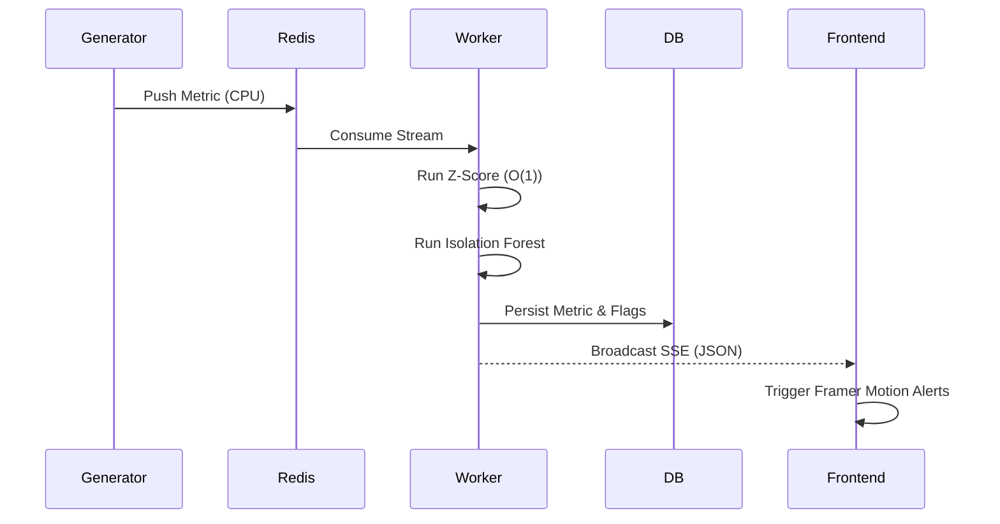
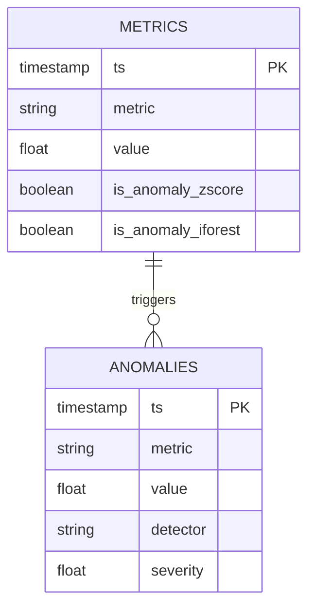

<div align="center">
  

  <h3><a href="https://github.com/AyushGU12/chronoshield">Real-Time Time-Series Anomaly Detection with Dual Machine Learning Pipelines</a></h3>

  <p>
    <a href="https://github.com/AyushGU12/chronoshield/stargazers"></a>
    <a href="https://github.com/AyushGU12/chronoshield/network/members"></a>
    <a href="https://github.com/AyushGU12/chronoshield/issues"></a>
    <a href="https://github.com/AyushGU12/chronoshield/blob/main/LICENSE"></a>
  </p>

  <a href="https://readme-typing-svg.herokuapp.com"></a>
</div>

---

## 📖 Executive Overview

**ChronoShield** is a high-performance, event-driven anomaly detection pipeline designed to ingest live time-series data and surface statistical aberrations in real-time. Built for Data Engineers, MLOps, and SREs, it balances immediate detection with machine learning accuracy by utilizing a dual-path architecture:

1. **Rolling Z-Score (Fast Path):** O(1) mathematical bounds checking for instantaneous spike detection.
2. **Isolation Forest (Smart Path):** Scikit-Learn based unsupervised machine learning that adapts to underlying data drift.

**Problem Solved:** Prevents silent failures in production by providing immediate, visually stunning visibility into metric spikes, data corruption, and system latency without the heavy overhead of traditional batch processing.

---

## 🏗 System Architecture

### 📊 High-Level Data Flow

```mermaid
graph LR
    A[Data Generator] -->|Redis Streams| B(FastAPI Worker)
    B -->|Z-Score Model| C{Detection Engine}
    B -->|IForest Model| C
    C -->|Anomaly Events| D[(TimescaleDB)]
    C -->|Server-Sent Events| E[React UI]
    E -->|Real-Time Chart| F[End User]
    
    style A fill:#06080F,stroke:#00E5FF
    style B fill:#06080F,stroke:#9D4EDD
    style C fill:#06080F,stroke:#FF0055
    style D fill:#06080F,stroke:#00E5FF
    style E fill:#06080F,stroke:#9D4EDD
```



### 🧬 Request & Detection Lifecycle



### 🗄 Database Schema (ER Diagram)



---

## 💻 Tech Stack & Analytics

<div align="center">
  
</div>

<br />

<details>
<summary><b>View GitHub Activity & Stats</b></summary>
<br />
<div align="center">
  
  
</div>
</details>

---

## 📂 Project Structure

```text
📦 chronoshield
 ┣ 📂 backend
 ┃ ┣ 📂 db               # TimescaleDB & SQLite connection logic
 ┃ ┣ 📂 detectors        # Z-Score & IForest algorithm implementations
 ┃ ┣ 📂 tests            # Pytest suites
 ┃ ┣ 📜 api.py           # FastAPI SSE Endpoints
 ┃ ┣ 📜 worker.py        # Stream consumption & detection pipeline
 ┃ ┣ 📜 generator.py     # Synthetic data generation
 ┃ ┗ 📜 requirements.txt
 ┣ 📂 frontend
 ┃ ┣ 📂 src
 ┃ ┃ ┣ 📂 components     # Recharts & Framer Motion UI
 ┃ ┃ ┣ 📂 hooks          # React SSE bindings
 ┃ ┃ ┣ 📜 App.jsx        # Glassmorphic grid layout
 ┃ ┃ ┗ 📜 index.css      # Design tokens & CSS vars
 ┃ ┣ 📜 package.json
 ┃ ┗ 📜 vite.config.js
 ┣ 📜 docker-compose.yml
 ┣ 📜 .env
 ┗ 📜 README.md
```

---

## ✨ Features

### ✅ Completed
- [x] **Dual Detection Engine:** Z-Score and Isolation Forest running in parallel.
- [x] **Live SSE Streaming:** Zero-polling, instant data propagation from backend to frontend.
- [x] **Glassmorphic UI:** Premium React/Vite dashboard with Framer Motion micro-animations.
- [x] **Advanced Charting:** Recharts Area charts with custom glowing SVG anomaly indicators.
- [x] **Database Agnostic:** Fallback to SQLite if TimescaleDB/Postgres is unavailable.

### 🔄 In Progress
- [ ] **Slack/Discord Alerting:** Webhook integration for severe anomalies.
- [ ] **Dynamic Threshold Tuning:** UI sliders to adjust detection sensitivity on the fly.

### 📌 Planned
- [ ] **Autoencoder Neural Networks:** Deep learning path for complex multivariate metrics.
- [ ] **Kubernetes Helm Charts:** For enterprise scale deployments.

---

## 🚀 Installation & Setup

### Prerequisites
- Python 3.10+
- Node.js 18+
- Docker & Docker Compose (Optional but recommended)

### 🐳 Docker Production Setup (Recommended)

```bash
# Clone the repository
git clone https://github.com/AyushGU12/chronoshield.git
cd chronoshield

# Start the entire stack (Redis, TimescaleDB, Backend, Frontend)
docker-compose up -d --build
```
> The dashboard will be available at `http://localhost:5173`

### 💻 Local Development Setup

<details>
<summary><b>Backend Setup (FastAPI)</b></summary>

```bash
cd backend
python -m venv .venv
source .venv/bin/activate  # On Windows: .venv\Scripts\activate
pip install -r requirements.txt

# Start the backend (Defaults to SQLite and In-Memory Queue)
../start_backend.bat
```
</details>

<details>
<summary><b>Frontend Setup (React/Vite)</b></summary>

```bash
cd frontend
npm install

# Start the dev server
../start_frontend.bat
```
</details>

---

## 📡 API Documentation

| Endpoint | Method | Description |
|----------|--------|-------------|
| `/health` | `GET` | Health check endpoint |
| `/api/stream` | `GET` | **SSE Stream**. Pushes live JSON metrics and anomaly flags |
| `/api/metrics` | `GET` | Retrieve historical metric data from DB |
| `/api/stats` | `GET` | Retrieve precision/recall statistics for both models |
| `/api/inject` | `POST` | Manually inject a synthetic anomaly into the stream |

---

## 🔐 Security & Reliability

- **CORS Configuration:** Strictly scoped to frontend origins (`localhost:5173`, etc).
- **Data Protection:** Prepared statements and ORM abstraction to prevent SQL Injection.
- **Fail-Safes:** Background threads gracefully degrade to in-memory queues if Redis is unreachable.

---

## ⚡ Performance & Scalability

- **Time Complexity:** The Rolling Z-Score detector executes in exactly **O(1)** time using running sums.
- **Concurrency:** FastAPI's `asyncio` combined with `threading.Event` allows thousands of SSE clients to subscribe to the single worker broadcast without blocking the detection loop.
- **Database Indexing:** TimescaleDB hypertable indexes on `(metric, timestamp DESC)` for lightning-fast historical queries.

---

## 🧪 Testing Strategy

Run the backend test suite:
```bash
cd backend
pytest tests/ -v --cov=.
```
- **Unit Tests:** Ensures mathematical correctness of Z-Score bounding and normalisation.
- **Integration Tests:** Validates stream queuing and SSE broadcast logic.

---

## 📈 Monitoring & Observability

- **Logs:** Structured standard output for all pipeline components.
- **Dashboard Stats:** The UI actively monitors Model Precision & Recall based on injected synthetic spikes vs caught spikes.

---

## 🤝 Contributing

1. Fork the Project
2. Create your Feature Branch (`git checkout -b feature/AmazingFeature`)
3. Commit your Changes (`git commit -m '✨ Add some AmazingFeature'`)
4. Push to the Branch (`git push origin feature/AmazingFeature`)
5. Open a Pull Request

---

<div align="center">
  
  
  <p><b>Built with ❤️ by <a href="https://github.com/AyushGU12">AyushGU12</a></b></p>
  <p><i>If this project helped you, please consider giving it a ⭐ on GitHub!</i></p>
</div>
